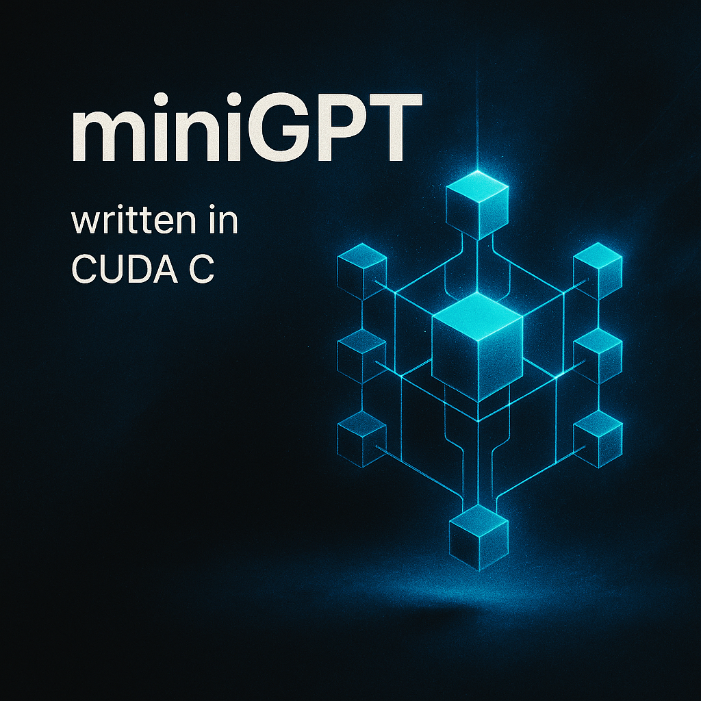

<p align="center">
  
</p>

<p align="center">
  <b>Tech Stack:</b> CUDA C++ · PyTorch (for reference) · Jupyter Notebook
</p>

---

# miniGPT

miniGPT is a minimal, CUDA-accelerated implementation of a transformer-based language model inspired by GPT architectures. This project demonstrates the core components of transformer inference, including attention, feedforward layers, and positional encoding, all implemented from scratch in CUDA C++.

## Project Requirements

- **CUDA Toolkit** (version 11.0 or higher recommended)
- **NVIDIA GPU** with compute capability 6.0+
- **g++** (for compiling C++/CUDA code)
- **Python 3.x** (for running notebooks and reference scripts)
- **PyTorch** (for reference and comparison, optional)
- **Jupyter Notebook** (for exploration and demonstration)

## How to Build and Run

1. **Clone the repository:**
   ```sh
   git clone https://github.com/yourusername/cuda-miniGPT.git
   cd cuda-miniGPT
    ```
2. **Compile the CUDA source code:**
   ```sh
   bash scripts/compile.sh
    ```

3. **Compile the CUDA source code:**
   ```sh
   ./build/minigptinference
    ```

4. **(Optional) Explore the Jupyter Notebook:**
   ```sh
   jupyter notebook miniGPT.ipynb
    ```
